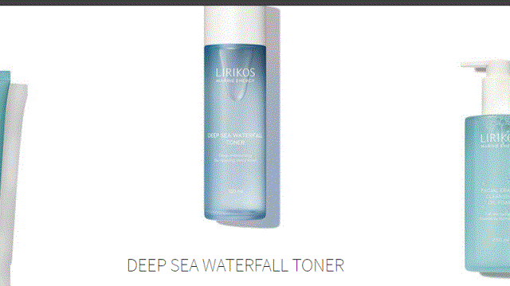
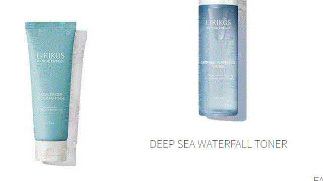

<h1># CloneStudy</h1>

## **수업 공통 코딩**
 

## 21년 6월28일
>호스팅 연결완료 ╰(*°▽°*)╯***

|페이지이름| 반응형|링크
|:--:|:--:|:--:|
|퍼시스|X|[link](http://alterego.woobi.co.kr/pf1/)|
|새움터|X|[link](http://alterego.woobi.co.kr/pf2/)|
|STATED|O|[link](http://alterego.woobi.co.kr/pf3/)|
|KARRY|O|[link](http://alterego.woobi.co.kr/pf4/)|

___
<h3>현재까지 사용 언어</h3>
<ul font-size="1.5em" color="#262626">
  <li>HTML</li>
  <li>CSS</li>
  <li>JavaScript</li>
  <li>Jquery</li>
</ul>

<pre font-size="30px">
최대한 원본사이트와 다르게 작업하려 
색상,이미지 파일, 레이아웃배치, 애니메이션부분은
수정하면서 작업.

<strong>※주의)초반 작업물은 똑같을 수 있음😅 </strong>
</pre>

___
##  🍳기록

## **21년 7월28일~**
### **#9-리리코스 클론코딩** 

>원본사이트링크 => [link](http://www.lirikosmarine.com/int/en/index.html)

* __header__ : __바닐라js 코딩__
  *  => 서치와 햄버거버튼 클릭시,  숨겨진 이벤트 발생

* __상단배너__ :
  * __swiper.js 사용__ 

* __BEST SELLERS 세션__ :  __바닐라js코딩__ 
  * mouseover이벤트 메서드로 src 경로가 바뀌게 했으나 
  transiton이 안먹혀서 코드를 전체 수정
  
  * 제품이미지 파일명을 배열에 담아 foreach함수로 img태그의 src와 
  hover시 나올 이미지는 background-image로 자동으로 담기게 수정
  
    * |수정전|수정후|
      |-|-|
      |||

## **21년 7월24일**
### **#8-Hello 2021,Create Cow**
### HTMl,CSS만으로 소만들기 

|완성된모습|정리|
|:--|:--|
|| svg나 canvas를 사용하지 않고 Negative Margins ,box-shadow,animation을 사용하여  역동적인 이미지 제작|
___

