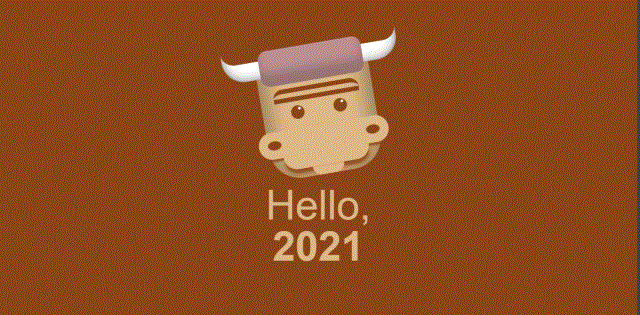

<h1># CloneStudy</h1>
<h2>수업 공통 코딩</h2>
<h3>현재까지 사용 언어</h3>
<ul font-size="1.5em" color="#262626">
  <li>HTML</li>
  <li>CSS</li>
  <li>JavaScript</li>
  <li>Jquery</li>
</ul>

<pre font-size="30px">
최대한 원본사이트와 다르게 작업하려 
색상,이미지 파일, 레이아웃배치, 애니메이션부분은
수정하면서 작업.

<strong>※주의)초반 작업물은 똑같을 수 있음😅 </strong>
</pre>

___

### 21년 7월24일
>HTMl,CSS만으로 소만들기 

|완성된모습|정리|
|:--|:--|
|| svg나 canvas를 사용하지 않고 Negative Margins ,box-shadow,animation을 사용하여  역동적인 이미지 제작|
___
### 21년 6월28일
>호스팅 연결완료 ╰(*°▽°*)╯***

|페이지이름| 반응형|링크
|:--:|:--:|:--:|
|퍼시스|X|[link](http://alterego.woobi.co.kr/pf1/)|
|새움터|X|[link](http://alterego.woobi.co.kr/pf2/)|
|STATED|O|[link](http://alterego.woobi.co.kr/pf3/)|
|KARRY|O|[link](http://alterego.woobi.co.kr/pf4/)|

___

